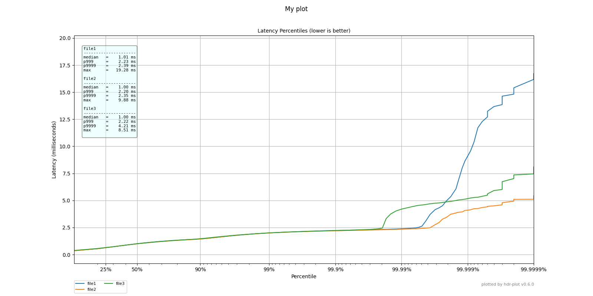

# hdr-plot for HdrHistogram

A standalone plotting script for https://github.com/giltene/wrk2 and
https://github.com/HdrHistogram/HdrHistogram.

This is just a quick and unsophisticated script to quickly plot the
HdrHistograms directly from the output of `wkr2` benchmarks.

For example:



## how to run

installation:

    pip3 install --upgrade --user hdr-plot

usage:

```
usage: hdr_plot.py [-h] [--output OUTPUT] [--title TITLE] [--nosummary]
                   [--noversion] [--units UNITS]
                   [--percentiles-range-max PERCENTILES_RANGE_MAX]
                   [--summary-fields SUMMARY_FIELDS]
                   files [files ...]

Plot HDRHistogram latencies.

positional arguments:
  files                 List HDR files to plot

optional arguments:
  -h, --help            show this help message and exit
  --output OUTPUT       Output file name (default: latency.png)
  --title TITLE         The plot title
  --nosummary           Do not plot the summary box
  --noversion           Does not plot the version of hdr-plot
  --units UNITS         The latency units (ns, us, ms)
  --percentiles-range-max PERCENTILES_RANGE_MAX
                        The maximum value of the percentiles range, e.g.
                        99.9999 (i.e. how many nines to display)
  --summary-fields SUMMARY_FIELDS
                        List of fields to show in the summary box. A comma-
                        separated list of: min, max, mean, median, p50, p90,
                        p99, p999, p9999, ..., p999999. Default:
                        median,p999,p9999,max
```

Then run `wrk` with the `-L` option and store the output into a file, like:

    wrk -t2 -c100 -d30s -R2000 -L http://127.0.0.1:8080/index.html &> result.out

Finally plot the percentile distribution:

    hdr-plot --output myplot.png --title "My plot" ./result.out [...]

You can provide more files to be plotted on the same graph:

    hdr-plot --output myplot.png --title "My plot" ./sample/file1.out ./sample/file2.out ./sample/file3.out

Please note that the name of the file is used as label for the plot legend.

## Acknowledgements

A special thank to [@Manuelbernhardt](https://github.com/manuelbernhardt)for providing PRs for a lot of improvements!

## License

Copyright © 2018-2023 Bruno Bonacci - Distributed under the [Apache License v 2.0](http://www.apache.org/licenses/LICENSE-2.0)
